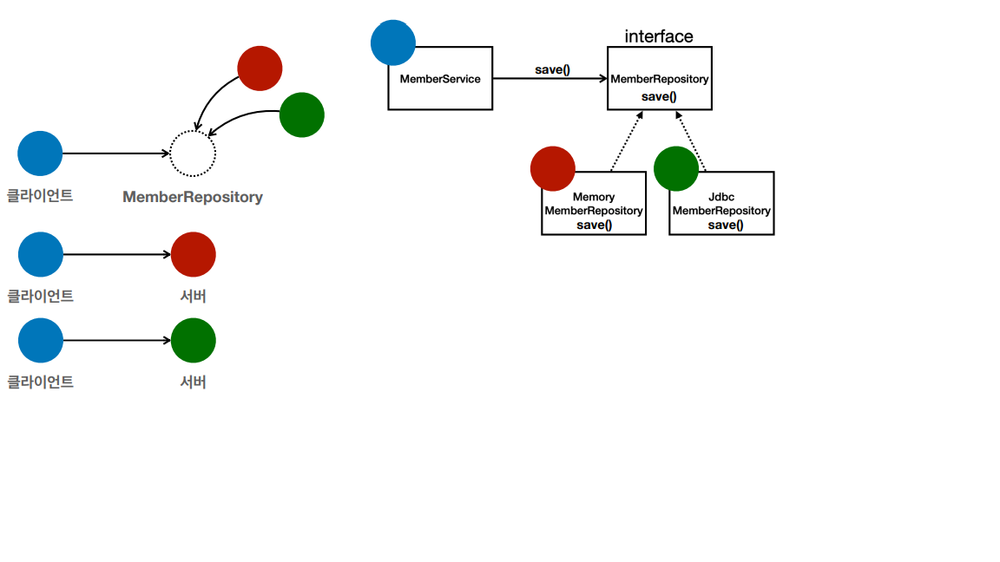

# 다형성 (Polymorphism)

>스프링과 객체 지향 -> 다형성이 가장 중요!

* 다형성의 실세계 비유  
>• 실세계와 객체 지향을 1:1로 매칭X  
• 그래도 실세계의 비유로 이해하기에는 좋음  
• 역할과 구현으로 세상을 구분  

* 예시  
• 운전자 - 자동차  
• 공연 무대  
• 키보드, 마우스, 세상의 표준 인터페이스들  
• 정렬 알고리즘 (더 나은 알고리즘으로 바꿀 수 있음)  
• 할인 정책 로직  

>운전자는 자동차(interface)가 바뀌어도 자동차의 역할만 알고 있으면 어떤 자동차든 몰 수 있다.
역할과 구현을 분리 -> 운전자를 클라이언트라고 하면 자동차의 내부 구조를 몰라도 된다.
클라이언트에 지장을 주지않고 새로운 기능을 추가할 수 있다

>로미오를 클라이언트, 줄리엣을 서버라고 하면 그게 누가 되든 바꿔서 사용할 수 있다.

* 역할과 구현을 분리  
>역할과 구현으로 구분하면 세상이 단순해지고, 유연해지며 변경도 편리해진다.  
• 유연하고, 변경이 용이    
• 확장 가능한 설계
-> MemoryMemberRepository에서 JdbcRepository로 변경할 때, Memory는 건들이지 않고 Jdbc만 새로 만들어서 변경할 수 있다는 점.    
• 클라이언트에 영향을 주지 않는 변경 가능  
• 인터페이스를 안정적으로 잘 설계하는 것이 중요  

* 장점  
1. 클라이언트는 대상의 역할(인터페이스)만 알면 된다.
2. 클라이언트는 구현 대상의 내부 구조를 몰라도 된다.
3. 클라이언트는 구현 대상의 내부 구조가 변경되어도 영향을 받지 않는다.
4. 클라이언트는 구현 대상 자체를 변경해도 영향을 받지 않는다
(줄리엣을 연기하는게 누구든 상관이 없다. 대체가능)

* 자바 언어  
• 자바 언어의 다형성을 활용  
• 역할 = 인터페이스  
• 구현 = 인터페이스를 구현한 클래스, 구현 객체  
• 객체를 설계할 때 역할과 구현을 명확히 분리  
• 객체 설계시 역할(인터페이스)을 먼저 부여하고, 그 역할을 수행하는 구현 객체 만들기  

* 객체의 협력이라는 관계부터 생각  
다형성을 생각하면 역할과 구현으로만 생각하는데, 클라이언트와 서버의 관계도 생각  
• 혼자 있는 객체는 없다.  
• 클라이언트: 요청, 서버: 응답  
• 수 많은 객체 클라이언트와 객체 서버는 서로 협력 관계를 가진다.  

클라이언트도 서버가 될 수 있다.

* 자바 언어의 다형성  
오버라이딩도 다형성을 적용한 것이다.  
오버라이딩 된 메서드가 실행  
다형성으로 인터페이스를 구현한 객체를 실행 시점에 유연하게 변경할 수 있다.  
물론 클래스 상속 관계도 다형성, 오버라이딩 적용가능  

오버로딩 : 메소드 여러개 정의

* 다형성의 본질  
• 인터페이스를 구현한 객체 인스턴스를 실행 시점에 유연하게 변경할 수 있다.  
• 다형성의 본질을 이해하려면 협력이라는 객체사이의 관계에서 시작해야함  
• 클라이언트를 변경하지 않고, 서버의 구현 기능을 유연하게 변경할 수 있다 (Memory -> Jdbc로 바꿀 수 있음)  

* 한계  
• 역할(인터페이스) 자체가 변하면, 클라이언트, 서버 모두에 큰 변경이 발생한다.  
• 자동차를 비행기로 변경해야 한다면?  
• 대본 자체가 변경된다면?  
• USB 인터페이스가 변경된다면?  
• 인터페이스를 안정적으로 잘 설계하는 것이 중요  